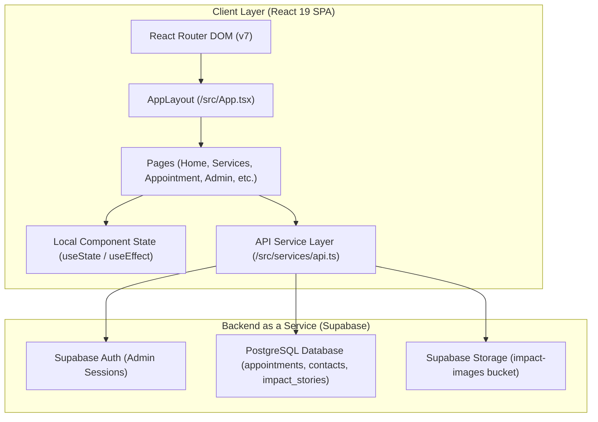
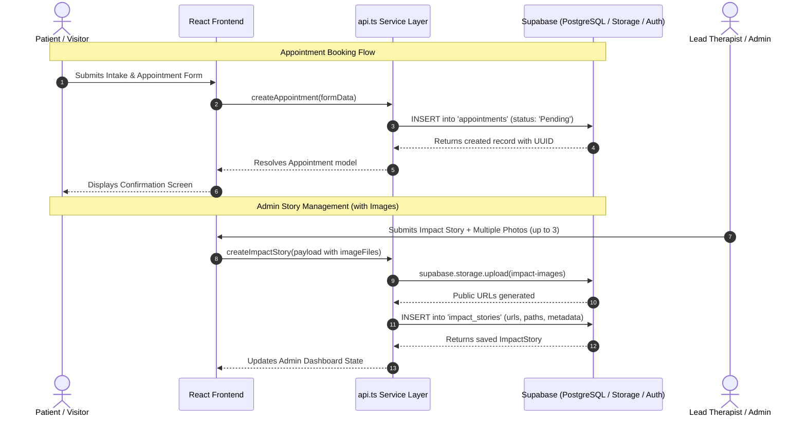

# Dial-a-Therapist Ghana — Architecture Documentation

This document provides a comprehensive technical breakdown of the **Dial-a-Therapist Ghana** web application codebase, covering system architecture, design tokens, runtime dependencies, directory breakdown, and end-to-end data flows.

---

## 1. High-Level System Design

Dial-a-Therapist is an interactive client-side Single Page Application (SPA) built with React 19 and Vite, integrated with a cloud-hosted Supabase backend (PostgreSQL, Auth, Storage).



### Architectural Pattern
- **Modular Component-Driven Architecture**: Structured around reusable views and page-level containers with distinct separation between presentation, state orchestration, and backend service communication.
- **Service Layer Abstraction**: All database, storage, and authentication communications pass through a unified API client wrapper ([`src/services/api.ts`](file:///c:/Users/Ayel-son/Desktop/codes/dial-a-therapist/src/services/api.ts)) that abstracts database schema transformations (`snake_case` database rows $\leftrightarrow$ `camelCase` TypeScript interfaces).
- **Client-Side Routing Model**: Powered by `react-router-dom` (v7) via `<Router>` and `<Routes>` in [`src/App.tsx`](file:///c:/Users/Ayel-son/Desktop/codes/dial-a-therapist/src/App.tsx).
  - Public routes: `/`, `/about`, `/services`, `/profile`, `/appointment`, `/impact`, `/contact`, `/login`.
  - Protected admin routes: `/admin/*` (delegated to [`AdminDashboard.tsx`](file:///c:/Users/Ayel-son/Desktop/codes/dial-a-therapist/src/pages/AdminDashboard.tsx) which performs active session and admin email validation).
  - Dynamic shell: The root `AppLayout` dynamically hides the public navigation bar when navigating within `/admin/*` paths to maximize workspace layout.
- **State Management**:
  - **Local Component State**: Handled using React core hooks (`useState`, `useEffect`).
  - **Form State**: Fully controlled input models with inline state transitions (`idle` $\rightarrow$ `loading` $\rightarrow$ `success` / `error`).
  - **Auth State**: Verified on route load using `supabase.auth.getUser()` and guarded against unauthorized roles via `VITE_ADMIN_EMAIL`.

---

## 2. Tech Stack & Runtime Libraries

| Category | Technology | Version | Purpose & Usage |
| :--- | :--- | :--- | :--- |
| **Core Framework** | React / React DOM | `^19.0.0` | Declarative UI rendering, modern hooks, and component lifecycle management. |
| **Routing** | React Router DOM | `^7.13.1` | Declarative client-side routing, route guards, and navigation state. |
| **Styling & CSS** | Tailwind CSS v4 / `@tailwindcss/vite` | `^4.1.14` | Next-generation engine with `@theme` CSS-first variables and utility classes. |
| **Animation Engine** | Motion (`motion/react`) | `^12.23.24` | Smooth micro-interactions, exit animations (`AnimatePresence`), and scroll/hover effects. |
| **Icons** | Lucide React | `^0.546.0` | Accessible, consistent icon library for clinical and healthcare indicators. |
| **BaaS & DB Client** | `@supabase/supabase-js` | `^2.98.0` | Handles PostgreSQL DB querying, storage file uploads/deletions, and admin auth. |
| **Build & Tooling** | Vite | `^6.2.0` | Ultra-fast development server with ES modules, HMR, and optimized production bundling. |
| **Language** | TypeScript | `~5.8.2` | Static type safety across database payloads, form interfaces, and API contracts. |

---

## 3. Design System & Styling Architecture

The styling strategy uses Tailwind CSS v4 configured directly in [`src/assets/styles/index.css`](file:///c:/Users/Ayel-son/Desktop/codes/dial-a-therapist/src/assets/styles/index.css) via the `@theme` directive, establishing a clinical, warm, and premium brand identity.

### Color Tokens & Palette Scale

| Token Name | Hex Code | Purpose / Usage |
| :--- | :--- | :--- |
| `--color-cream` (Base) | `#f6f2e8` | Primary warm background for hero sections, cards, and accent banners. |
| `--color-cream-light` | `#fff8e2` | Highlight badges, tag backgrounds, and subtle pill containers. |
| `--color-charcoal` | `#2D2D2D` | Primary text color, dark cards, footer, and navigation bar background. |
| `--color-charcoal-deep` | `#222222` | Dark hover states and high-contrast admin dashboard elements. |
| `--color-charcoal-soft` | `#3A3A3A` | Secondary dark backgrounds and card accents. |
| `--color-gold` | `#b89b4a` | Primary brand accent color, CTA buttons, active links, and key highlights. |
| `--color-gold-light` | `#d9c78e` | Subtle borders, muted subtitle text, and glowing accents. |
| `--color-gold-dark` | `#8d7534` | Hover states for gold CTA buttons and high-contrast badge text. |
| `gold-gradient` | `#D4AF37` $\rightarrow$ `#996515` | Linear gradient used for hero accents, badges, and decorative fills. |

### Typography Hierarchy

- **Sans Serif (`--font-sans`)**: `"Inter", ui-sans-serif, system-ui, sans-serif` — Used for body copy, data tables, form inputs, and clinical descriptions for optimal readability.
- **Serif (`--font-serif`)**: `"Playfair Display", serif` — Applied to editorial headings, quotes, testimonials, and brand banners.

---

## 4. Directory Structure

```text
dial-a-therapist/
├── docs/                        # Technical guides, setup manuals, and SQL schemas
│   ├── admin-user-manual.md     # Admin guide for managing appointments & stories
│   ├── developer-it-manual.md   # Setup, deployment, and environment guide
│   ├── supabase-setup.sql       # Database schema, RLS policies, and triggers
│   └── visitor-user-manual.md   # User guide for visitors and patients
├── public/                      # Static public assets (favicon.svg, etc.)
├── src/                         # Core application source code
│   ├── assets/                  # Static styles and local image assets
│   │   ├── images/              # Local imagery (e.g., therapist profile pictures)
│   │   └── styles/              # Global stylesheet & Tailwind CSS theme definitions
│   │       └── index.css
│   ├── components/              # Reusable UI component modules
│   │   ├── common/              # Generic UI elements (modals, buttons, spinners)
│   │   └── layout/              # Structural wrappers (headers, shells, grids)
│   ├── hooks/                   # Custom React hooks
│   ├── pages/                   # Top-level page views (route destinations)
│   │   ├── About.tsx            # Mission, vision, core values, and approach
│   │   ├── AdminDashboard.tsx   # Admin appointment manager and impact story CMS
│   │   ├── AppointmentRequest.tsx# Comprehensive patient intake and booking form
│   │   ├── CommunityImpact.tsx  # Public impact gallery, outreach stories & testimonials
│   │   ├── Contact.tsx          # General inquiry contact form and office details
│   │   ├── Home.tsx             # Landing page with hero, service highlights & CTAs
│   │   ├── Login.tsx            # Secure admin sign-in view
│   │   ├── NotFound.tsx         # 404 error screen
│   │   ├── Profile.tsx          # Lead Occupational Therapist credentials and bio
│   │   └── Services.tsx         # Detailed breakdown of Pediatrics & Mental Health OT
│   ├── services/                # External API wrappers & integrations
│   │   ├── api.ts               # Core CRUD endpoints for appointments, contact & stories
│   │   └── supabase.ts          # Supabase client instantiation and environment keys
│   ├── types/                   # TypeScript interfaces and shared type definitions
│   │   └── index.ts             # Domain models (Appointment, ImpactStory, ServiceCategory)
│   ├── App.tsx                  # Root layout, navigation bar, footer, and route table
│   ├── main.tsx                 # Application entry point with React 19 root mounting
│   └── vite-env.d.ts            # Vite client environment type declarations
├── index.html                   # HTML entry template
├── package.json                 # Project dependencies, build scripts, and metadata
├── tsconfig.json                # TypeScript compilation options
└── vite.config.ts               # Vite configuration with Tailwind CSS & React plugins
```

---

## 5. Data Flow & External Integrations



### 1. Appointment Booking & Intake Pipeline
- **Form Path**: [`src/pages/AppointmentRequest.tsx`](file:///c:/Users/Ayel-son/Desktop/codes/dial-a-therapist/src/pages/AppointmentRequest.tsx)
- **Data Model**: Captures patient personal details, contact info, emergency contacts, medical history, preferred appointment slots, and formal legal consent.
- **Storage Target**: Stored in the `appointments` table with initial status `'Pending'`.
- **Admin Workflow**: Admin reviews submissions in [`AdminDashboard.tsx`](file:///c:/Users/Ayel-son/Desktop/codes/dial-a-therapist/src/pages/AdminDashboard.tsx) and can update status to `'Confirmed'` or `'Cancelled'`.

### 2. Contact Inquiries
- **Form Path**: [`src/pages/Contact.tsx`](file:///c:/Users/Ayel-son/Desktop/codes/dial-a-therapist/src/pages/Contact.tsx)
- **Action**: Persists visitor name, email, subject, and message directly to the `contacts` table via `api.createContact()`.

### 3. Community Impact Stories & Media Management
- **Public Feed**: [`src/pages/CommunityImpact.tsx`](file:///c:/Users/Ayel-son/Desktop/codes/dial-a-therapist/src/pages/CommunityImpact.tsx) fetches published stories via `api.getImpactStoriesPublic()`, featuring image carousels, expandable quotes, and external links, with fallback stories when offline.
- **Admin CMS**: [`src/pages/AdminDashboard.tsx`](file:///c:/Users/Ayel-son/Desktop/codes/dial-a-therapist/src/pages/AdminDashboard.tsx) allows full CRUD operations.
- **Multi-Image Uploads**:
  - Validates and uploads up to 3 images per story to the `impact-images` Supabase Storage bucket.
  - Generates public URLs and records storage file paths for automated cleanup upon story deletion or image updates.

### 4. Direct Messaging & Telephony Integration
- **WhatsApp Direct Connect**: Interactive floating action button configured in [`src/App.tsx`](file:///c:/Users/Ayel-son/Desktop/codes/dial-a-therapist/src/App.tsx) pre-populates therapy inquiry messages to `+233 59 930 9776` via `https://wa.me/233599309776`.
- **Direct Phone & Email Channels**: Click-to-call (`tel:+233552989900`) and mailto (`mailto:info@dialatherapistgh.com`) links throughout navigation and footer.
