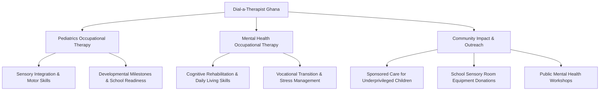
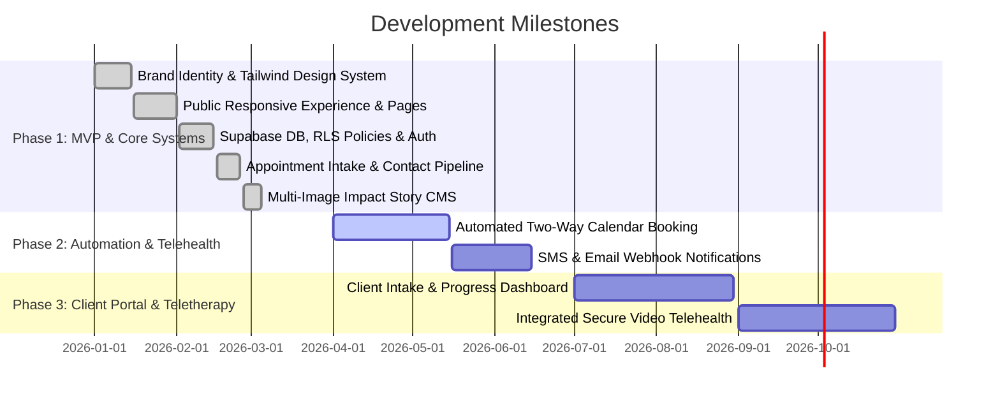

# Dial-a-Therapist Ghana — Executive Project Overview

**Document Purpose**: Executive summary of Dial-a-Therapist Ghana for developers, technical maintainers, clinical directors, and organizational stakeholders.

---

## 1. Executive Summary & Clinical Mission

**Dial-a-Therapist Ghana** is a healthcare platform and occupational therapy practice dedicated to delivering accessible, compassionate, person-centered therapy across Ghana and West Africa. 

### Mission & Philosophy
- **Core Philosophy**: *"Your care is our care."*
- **Clinical Mission**: Empower individuals across all age brackets to overcome physical, sensory, cognitive, and psychosocial barriers through evidence-based occupational therapy.
- **Practice Leadership**: Led by **OT Mildred A. Wiredu**, Deputy Head of Occupational Therapy at Pantang Hospital, with dual licensing from the Allied Health Professions Council of Ghana (AHPC) and the Health Professions Council of South Africa (HPCSA).

### Core Clinical Services & Focus Areas
1. **Pediatrics Occupational Therapy**:
   - Developmental milestone assessments, motor skills training, sensory integration therapy, ADL (Activities of Daily Living) coaching, caregiver education, and classroom behavioral support.
2. **Mental Health Occupational Therapy**:
   - Cognitive rehabilitation, psychosocial skills building, transition-to-work programs, emotional regulation, community reintegration, and supported independent living.
3. **Community Impact & Social Initiatives**:
   - Subsidized and fully sponsored therapy sessions for children with cerebral palsy and neurodivergent conditions.
   - Sensory room donations to special education centers (e.g., Grace Special School).
   - Regional advocacy and free community screening workshops in Accra and Kumasi.

---

## 2. Current Development Stage & Completed Milestones

The project is currently at **Production-Ready / Operational MVP Stage (Phase 1 Complete)** with a fully functional client portal and secure admin management system.

### Completed Milestones
- [x] **Responsive Public Web Portal**: Home, About, Services, Clinical Profile, Impact, and Contact routes built with React 19, Vite, and Motion.
- [x] **Design System Implementation**: Warm Cream (`#f6f2e8`), Deep Charcoal (`#2D2D2D`), and Gold scale (`#b89b4a`) tokens with custom responsive typography.
- [x] **Full-Scope Patient Intake Form**: Multi-section digital intake covering personal background, emergency contacts, medical history, slot preferences, and legal consent.
- [x] **Supabase Backend Integration**:
  - PostgreSQL schema with Row-Level Security (RLS) policies for anonymous submissions and authenticated admin management.
  - Supabase Storage bucket (`impact-images`) configured for multi-image storage with automated orphan deletion.
- [x] **Admin Content & Triage Dashboard**:
  - Secure session-based authentication with email verification.
  - Appointment management with status controls (`Pending`, `Confirmed`, `Cancelled`) and full intake details modal.
  - Impact Story publishing CMS with multi-photo upload capabilities (up to 3 photos per story).
- [x] **Instant Messaging Integration**: Direct WhatsApp floating action button pre-wired to Ghanaian WhatsApp lines.

---

## 3. Product & Technology Roadmap

The development roadmap is structured into three upcoming phases designed to scale the practice from digital intake into automated clinic management and virtual care delivery.

```mermaid
flowchart LR
    subgraph P2 ["Phase 2: Automation & Notifications"]
        A1["Two-Way Calendar Sync (Google / Cal.com)"]
        A2["Automated SMS / Email Confirmations"]
        A3["Mobile Money (MoMo) / Paystack Payment Gateway"]
    end

    subgraph P3 ["Phase 3: Patient Portal & Telehealth"]
        B1["Patient Login & Intake History"]
        B2["Home Program & Exercise Tracker"]
        B3["Encrypted Video Telehealth Consultation"]
    end

    subgraph P4 ["Phase 4: Multi-Therapist Practice Scaling"]
        C1["Therapist Role-Based Access Control (RBAC)"]
        C2["Clinical Session Notes & EMR Integration"]
        C3["Clinical Outcome Analytics & Impact Reports"]
    end

    P2 --> P3 --> P4
```

### Phase 2: Scheduling Automation & Communication Pipelines
- **Automated Real-Time Calendar Integration**:
  - Integrate two-way therapist calendar availability (Google Calendar / Cal.com / custom slot locking) to eliminate manual scheduling back-and-forth.
- **Transactional Notifications**:
  - Automated WhatsApp/SMS booking confirmations and appointment reminders via Twilio or local Ghana SMS gateways (Hubtel / Arkesel).
  - Automated email receipts via Resend or SendGrid.
- **Payment Processing (Paystack / Mobile Money)**:
  - Enable consultation deposits and session payments via MTN MoMo, Telecel Cash, AirtelTigo, and Cards.

### Phase 3: Patient Portal & Teletherapy Suite
- **Patient Dashboard (`/portal`)**:
  - Patient login to view scheduled appointments, treatment plans, home therapy exercises, and downloadable receipts.
- **Secure Telehealth Video Rooms**:
  - WebRTC-based virtual consultation rooms for remote parent coaching and mental health follow-ups.
- **Progress Tracking & Milestone Checklists**:
  - Interactive checklists for parents to log daily sensory integration and developmental milestone progress.

### Phase 4: Multi-Therapist Practice Management & Analytics
- **Role-Based Access Control (RBAC)**:
  - Multi-practitioner support assigning specific patients and appointments to affiliated occupational therapists.
- **Electronic Medical Records (EMR) Compliance**:
  - Encrypted SOAP notes (Subjective, Objective, Assessment, Plan) and clinical record exports.
- **Impact & Grant Reporting Engine**:
  - Automated generation of impact metrics and outreach reports for NGO partnerships and donors.

---

## 4. Technical Architecture Summary

| Layer | Implementation | Details |
| :--- | :--- | :--- |
| **Frontend Framework** | React 19 + TypeScript | SPA architecture with Vite 6 build tooling |
| **Routing** | React Router DOM v7 | Route-level layouts and admin authentication guards |
| **Styling** | Tailwind CSS v4 | CSS-first `@theme` design system configuration |
| **Animation** | Motion (`motion/react`) | Fluid layout transitions and viewport-triggered animations |
| **Backend & DB** | Supabase (PostgreSQL 15) | Relational tables (`appointments`, `contacts`, `impact_stories`) |
| **Security** | Supabase Auth + RLS | Email-guarded Row-Level Security policies |
| **Media Storage** | Supabase Storage | `impact-images` bucket for public CDN delivery |
| **Direct Channels** | WhatsApp API + Tel/Mailto | Pre-formatted message routing to WhatsApp Ghana line |
